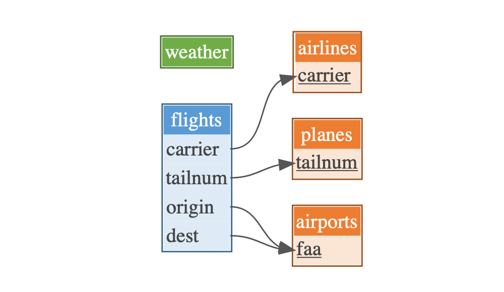

<!-- badges: start -->

[](https://www.tidyverse.org/lifecycle/#experimental)
[](https://travis-ci.org/krlmlr/dm)
[](https://codecov.io/gh/krlmlr/dm?branch=master)
[](https://cran.r-project.org/package=dm)
<!-- badges: end -->

# dm

The goal of {dm} is to provide tools for working with multiple tables.
Skip to the [Features section](#features) if you are familiar with
relational data models.

  - [Why?](#why) gives a short motivation
  - [Features](#features) gives a one-page overview over the scope of
    this package
  - [Example](#example) outlines some of the features in a short example
  - [More information](#more-information) offers links to more detailed
    articles
  - [Standing on the shoulders of
    giants](#standing-on-the-shoulders-of-giants) shows related work
  - [Installation](#installation) describes how to install the package

## Why?

As an example, we consider the
[nycflights13](https://github.com/hadley/nycflights13) dataset. This
dataset contains five tables: the main `flights` table with links into
the `airlines`, `planes` and `airports` tables, and a `weather` table
without an explicit link.



The separation into multiple tables achieves several goals:

  - **Avoid repetition, conserve memory**: the facts about each airline,
    airport, and airplane are stored only once
      - name of each airline
      - name, location and altitude of each airport
      - manufacturer and number of seats for each airplane
  - **Improve consistency**: if facts (e.g. the name of an airport) need
    to be updated, they need to be updated in only one place
  - **Segmentation**: facts are organized by topic, individual tables
    are smaller and easier to handle

The links are established through *primary* and *foreign keys*: a
primary key identifies rows/tuples/observations of *this* table, foreign
keys link to a row/tuple/observation in *another* table. See the [Simple
English Wikipedia article on database
normalization](https://simple.wikipedia.org/wiki/Database_normalisation)
for more detail.

### Joining

The separation into multiple tables helps data quality but poses a
different challenge: for each flight, the location of the origin
airport, or the details on the airplane, are not available immediately
but must be *joined*/merged:

``` r
library(tidyverse)
library(nycflights13)

flights %>% 
  select(month, day, origin, tailnum) %>% 
  left_join(airports, by = c("origin" = "faa")) %>% 
  left_join(planes, by = "tailnum")
```

<PRE class="fansi fansi-output"><CODE>#&gt; <span style='color: #555555;'># A tibble: 336,776 x 19</span><span>
#&gt;    </span><span style='font-weight: bold;'>month</span><span>   </span><span style='font-weight: bold;'>day</span><span> </span><span style='font-weight: bold;'>origin</span><span> </span><span style='font-weight: bold;'>tailnum</span><span> </span><span style='font-weight: bold;'>name</span><span>    </span><span style='font-weight: bold;'>lat</span><span>   </span><span style='font-weight: bold;'>lon</span><span>   </span><span style='font-weight: bold;'>alt</span><span>    </span><span style='font-weight: bold;'>tz</span><span> </span><span style='font-weight: bold;'>dst</span><span>   </span><span style='font-weight: bold;'>tzone</span><span>
#&gt;    </span><span style='color: #555555;font-style: italic;'>&lt;int&gt;</span><span> </span><span style='color: #555555;font-style: italic;'>&lt;int&gt;</span><span> </span><span style='color: #555555;font-style: italic;'>&lt;chr&gt;</span><span>  </span><span style='color: #555555;font-style: italic;'>&lt;chr&gt;</span><span>   </span><span style='color: #555555;font-style: italic;'>&lt;chr&gt;</span><span> </span><span style='color: #555555;font-style: italic;'>&lt;dbl&gt;</span><span> </span><span style='color: #555555;font-style: italic;'>&lt;dbl&gt;</span><span> </span><span style='color: #555555;font-style: italic;'>&lt;int&gt;</span><span> </span><span style='color: #555555;font-style: italic;'>&lt;dbl&gt;</span><span> </span><span style='color: #555555;font-style: italic;'>&lt;chr&gt;</span><span> </span><span style='color: #555555;font-style: italic;'>&lt;chr&gt;</span><span>
#&gt; </span><span style='color: #555555;'> 1</span><span>     1     1 EWR    N14228  Newa…  40.7 -</span><span style='color: #BB0000;'>74.2</span><span>    18    -</span><span style='color: #BB0000;'>5</span><span> A     Amer…
#&gt; </span><span style='color: #555555;'> 2</span><span>     1     1 LGA    N24211  La G…  40.8 -</span><span style='color: #BB0000;'>73.9</span><span>    22    -</span><span style='color: #BB0000;'>5</span><span> A     Amer…
#&gt; </span><span style='color: #555555;'> 3</span><span>     1     1 JFK    N619AA  John…  40.6 -</span><span style='color: #BB0000;'>73.8</span><span>    13    -</span><span style='color: #BB0000;'>5</span><span> A     Amer…
#&gt; </span><span style='color: #555555;'> 4</span><span>     1     1 JFK    N804JB  John…  40.6 -</span><span style='color: #BB0000;'>73.8</span><span>    13    -</span><span style='color: #BB0000;'>5</span><span> A     Amer…
#&gt; </span><span style='color: #555555;'> 5</span><span>     1     1 LGA    N668DN  La G…  40.8 -</span><span style='color: #BB0000;'>73.9</span><span>    22    -</span><span style='color: #BB0000;'>5</span><span> A     Amer…
#&gt; </span><span style='color: #555555;'> 6</span><span>     1     1 EWR    N39463  Newa…  40.7 -</span><span style='color: #BB0000;'>74.2</span><span>    18    -</span><span style='color: #BB0000;'>5</span><span> A     Amer…
#&gt; </span><span style='color: #555555;'> 7</span><span>     1     1 EWR    N516JB  Newa…  40.7 -</span><span style='color: #BB0000;'>74.2</span><span>    18    -</span><span style='color: #BB0000;'>5</span><span> A     Amer…
#&gt; </span><span style='color: #555555;'> 8</span><span>     1     1 LGA    N829AS  La G…  40.8 -</span><span style='color: #BB0000;'>73.9</span><span>    22    -</span><span style='color: #BB0000;'>5</span><span> A     Amer…
#&gt; </span><span style='color: #555555;'> 9</span><span>     1     1 JFK    N593JB  John…  40.6 -</span><span style='color: #BB0000;'>73.8</span><span>    13    -</span><span style='color: #BB0000;'>5</span><span> A     Amer…
#&gt; </span><span style='color: #555555;'>10</span><span>     1     1 LGA    N3ALAA  La G…  40.8 -</span><span style='color: #BB0000;'>73.9</span><span>    22    -</span><span style='color: #BB0000;'>5</span><span> A     Amer…
#&gt; </span><span style='color: #555555;'># … with 336,766 more rows, and 8 more variables: </span><span style='color: #555555;font-weight: bold;'>year</span><span style='color: #555555;'> </span><span style='color: #555555;font-style: italic;'>&lt;int&gt;</span><span style='color: #555555;'>, </span><span style='color: #555555;font-weight: bold;'>type</span><span style='color: #555555;'> </span><span style='color: #555555;font-style: italic;'>&lt;chr&gt;</span><span style='color: #555555;'>,
#&gt; #   </span><span style='color: #555555;font-weight: bold;'>manufacturer</span><span style='color: #555555;'> </span><span style='color: #555555;font-style: italic;'>&lt;chr&gt;</span><span style='color: #555555;'>, </span><span style='color: #555555;font-weight: bold;'>model</span><span style='color: #555555;'> </span><span style='color: #555555;font-style: italic;'>&lt;chr&gt;</span><span style='color: #555555;'>, </span><span style='color: #555555;font-weight: bold;'>engines</span><span style='color: #555555;'> </span><span style='color: #555555;font-style: italic;'>&lt;int&gt;</span><span style='color: #555555;'>, </span><span style='color: #555555;font-weight: bold;'>seats</span><span style='color: #555555;'> </span><span style='color: #555555;font-style: italic;'>&lt;int&gt;</span><span style='color: #555555;'>,
#&gt; #   </span><span style='color: #555555;font-weight: bold;'>speed</span><span style='color: #555555;'> </span><span style='color: #555555;font-style: italic;'>&lt;int&gt;</span><span style='color: #555555;'>, </span><span style='color: #555555;font-weight: bold;'>engine</span><span style='color: #555555;'> </span><span style='color: #555555;font-style: italic;'>&lt;chr&gt;</span><span>
</span></CODE></PRE>

## Features

This package helps with many challenges that arise when working with
relational data models.

### Compound object

The `dm` class manages several related tables. It stores both the
**data** and the **metadata** in a compound object, and defines
operations on that object. These operations either affect the data
(e.g., a filter), or the metadata (e.g., definition of keys or creation
of a new table), or both.

  - data: a table source storing all tables
  - metadata: table names, column names, primary and foreign keys

This concept helps separating the join logic from the code: declare your
relationships once, as part of your data, then use them in your code
without repeating yourself.

### Storage agnostic

The {dm} package augments
[{dplyr}](https://dplyr.tidyverse.org/)/[{dbplyr}](https://dbplyr.tidyverse.org/)
workflows. Generally, if you can use {dplyr} on your data, it’s likely
that you can use {dm} too. This includes local data frames, relational
database systems, and many more.

### Data preparation

A battery of utilities helps with creating a tidy relational data model.

  - Splitting and rejoining tables
  - Determining key candidates
  - Checking keys and cardinalities

## Example

A readymade `dm` object with preset keys is included in the package:

``` r
library(dm)

cdm_nycflights13()
```

<PRE class="fansi fansi-output"><CODE>#&gt; <span style='color: #00BB00;'>──</span><span> </span><span style='color: #00BB00;'>Table source</span><span> </span><span style='color: #00BB00;'>───────────────────────────────────────────────────────────</span><span>
#&gt; src:  &lt;package: nycflights13&gt;
#&gt; </span><span style='color: #555555;'>──</span><span> </span><span style='color: #555555;'>Data model</span><span> </span><span style='color: #555555;'>─────────────────────────────────────────────────────────────</span><span>
#&gt; Data model object:
#&gt;   5 tables:  airlines, airports, flights, planes ... 
#&gt;   53 columns
#&gt;   3 primary keys
#&gt;   4 references
#&gt; </span><span style='color: #BBBB00;'>──</span><span> </span><span style='color: #BBBB00;'>Rows</span><span> </span><span style='color: #BBBB00;'>───────────────────────────────────────────────────────────────────</span><span>
#&gt; Total: 367687
#&gt; airlines: 16, airports: 1458, flights: 336776, planes: 3322, weather: 26115
</span></CODE></PRE>

The `cdm_draw()` function creates a visualization of the entity
relationship model:

``` r
cdm_nycflights13(cycle = TRUE) %>% 
  cdm_draw()
```


### Filtering and joining

Similarly to `dplyr::filter()`, a filtering function `cdm_filter()` is
available for `dm` objects. You need to provide the `dm` object, the
table whose rows you want to filter, and the filter expression. A `dm`
object is returned whose tables only contain rows that are related to
the reduced rows in the filtered table. This currently only works for
cycle-free relationships between the tables.

``` r
cdm_nycflights13(cycle = FALSE) %>%
  cdm_get_tables() %>%
  map_int(nrow)
#> airlines airports  flights   planes  weather 
#>       16     1458   336776     3322    26115

cdm_nycflights13(cycle = FALSE) %>% 
  cdm_filter(planes, year == 2000, manufacturer == "BOEING") %>%
  cdm_get_tables() %>%
  map_int(nrow)
#> airlines airports  flights   planes  weather 
#>        4        3     7301      134    26115
```

For joining two tables using their relationship defined in the `dm`, you
can use `cdm_join_tbl()`:

``` r
cdm_nycflights13(cycle = FALSE) %>%
  cdm_join_tbl(airports, flights, join = semi_join)
```

<PRE class="fansi fansi-output"><CODE>#&gt; <span style='color: #555555;'># A tibble: 3 x 8</span><span>
#&gt;   </span><span style='font-weight: bold;'>faa</span><span>   </span><span style='font-weight: bold;'>name</span><span>                  </span><span style='font-weight: bold;'>lat</span><span>   </span><span style='font-weight: bold;'>lon</span><span>   </span><span style='font-weight: bold;'>alt</span><span>    </span><span style='font-weight: bold;'>tz</span><span> </span><span style='font-weight: bold;'>dst</span><span>   </span><span style='font-weight: bold;'>tzone</span><span>           
#&gt;   </span><span style='color: #555555;font-style: italic;'>&lt;chr&gt;</span><span> </span><span style='color: #555555;font-style: italic;'>&lt;chr&gt;</span><span>               </span><span style='color: #555555;font-style: italic;'>&lt;dbl&gt;</span><span> </span><span style='color: #555555;font-style: italic;'>&lt;dbl&gt;</span><span> </span><span style='color: #555555;font-style: italic;'>&lt;int&gt;</span><span> </span><span style='color: #555555;font-style: italic;'>&lt;dbl&gt;</span><span> </span><span style='color: #555555;font-style: italic;'>&lt;chr&gt;</span><span> </span><span style='color: #555555;font-style: italic;'>&lt;chr&gt;</span><span>           
#&gt; </span><span style='color: #555555;'>1</span><span> EWR   Newark Liberty Intl  40.7 -</span><span style='color: #BB0000;'>74.2</span><span>    18    -</span><span style='color: #BB0000;'>5</span><span> A     America/New_York
#&gt; </span><span style='color: #555555;'>2</span><span> JFK   John F Kennedy Intl  40.6 -</span><span style='color: #BB0000;'>73.8</span><span>    13    -</span><span style='color: #BB0000;'>5</span><span> A     America/New_York
#&gt; </span><span style='color: #555555;'>3</span><span> LGA   La Guardia           40.8 -</span><span style='color: #BB0000;'>73.9</span><span>    22    -</span><span style='color: #BB0000;'>5</span><span> A     America/New_York
</span></CODE></PRE>

In our `dm`, the `origin` column of the `flights` table points to the
`airports` table. Since all `nycflights13`-flights depart from New York,
only these airports are included in the semi-join.

### From and to databases

In order to transfer an existing `dm` object to a DB, you can call
`cdm_copy_to()` with the target DB and the `dm` object:

``` r
src_sqlite <- src_sqlite(":memory:", create = TRUE)
src_sqlite
#> src:  sqlite 3.25.3 [:memory:]
#> tbls:
nycflights13_remote <- cdm_copy_to(src_sqlite, cdm_nycflights13(cycle = TRUE))
nycflights13_remote
```

<PRE class="fansi fansi-output"><CODE>#&gt; <span style='color: #00BB00;'>──</span><span> </span><span style='color: #00BB00;'>Table source</span><span> </span><span style='color: #00BB00;'>───────────────────────────────────────────────────────────</span><span>
#&gt; src:  sqlite 3.25.3 [:memory:]
#&gt; </span><span style='color: #555555;'>──</span><span> </span><span style='color: #555555;'>Data model</span><span> </span><span style='color: #555555;'>─────────────────────────────────────────────────────────────</span><span>
#&gt; Data model object:
#&gt;   5 tables:  airlines, airports, flights, planes ... 
#&gt;   53 columns
#&gt;   3 primary keys
#&gt;   4 references
#&gt; </span><span style='color: #BBBB00;'>──</span><span> </span><span style='color: #BBBB00;'>Rows</span><span> </span><span style='color: #BBBB00;'>───────────────────────────────────────────────────────────────────</span><span>
#&gt; Total: 367687
#&gt; airlines: 16, airports: 1458, flights: 336776, planes: 3322, weather: 26115
</span></CODE></PRE>

The key constraints from the original object are also copied to the
newly created object. With the default setting `set_key_constraints =
TRUE` for `cdm_copy_to()`, key constraints are also established on the
target DB. Currently this feature is only supported for MSSQL and
Postgres database management systems (DBMS).

It is also possible to automatically create a `dm` object from the
permanent tables of a DB. Again, for now just MSSQL and Postgres are
supported for this feature, so the next chunk is not evaluated. The
support for other DBMS will be implemented in a future update.

``` r
src_postgres <- src_postgres()
nycflights13_from_remote <- cdm_learn_from_db(src_postgres)
```

## More information

If you would like to learn more about {dm}, the [Intro
article](https://krlmlr.github.io/dm/articles/dm.html) is a good place
to start. Further resources:

  - [Function
    reference](https://krlmlr.github.io/dm/reference/index.html)
  - [Class ‘dm’ and basic
    operations](https://krlmlr.github.io/dm/articles/dm-class-and-basic-operations.html)
    article
  - [Visualizing ‘dm’
    objects](https://krlmlr.github.io/dm/articles/dm-visualization.html)
    article
  - [Low-level
    operations](https://krlmlr.github.io/dm/articles/dm-low-level.html)
    article
    <!-- FIXME: vignettes missing; once there, needs to be linked -->

## Standing on the shoulders of giants

This package follows the tidyverse principles:

  - `dm` objects are immutable (your data will never be overwritten in
    place)
  - many functions used on `dm` objects are pipeable (i.e., return new
    `dm` objects)
  - tidy evaluation is used (unquoted function parameters are supported)

The {dm} package builds heavily upon the [{datamodelr}
package](https://github.com/bergant/datamodelr), and upon the
[tidyverse](https://www.tidyverse.org/). We’re looking forward to a good
collaboration\!

The [{polyply} package](https://github.com/russHyde/polyply) has a
similar intent with a slightly different interface.

Articles in the [{rquery} package](https://github.com/WinVector/rquery)
discuss [join
controllers](https://github.com/WinVector/rquery/blob/master/extras/JoinController.md)
and [join dependency
sorting](https://github.com/WinVector/rquery/blob/master/extras/DependencySorting.md),
with the intent to move the declaration of table relationships from code
to data.

The [{tidygraph} package](https://github.com/thomasp85/tidygraph) stores
a network as two related tables of `nodes` and `edges`, compatible with
{dplyr} workflows.

In object-oriented programming languages, [object-relational
mapping](https://en.wikipedia.org/wiki/Object-relational_mapping) is a
similar concept that attempts to map a set of related tables to a class
hierarchy.

## Installation

Once on CRAN, the package can be installed with

``` r
install.packages("dm")
```

Install the latest development version with

``` r
# install.packages("devtools")
devtools::install_github("krlmlr/dm")
```

-----

License: MIT © cynkra GmbH.

Funded by:

[](https://www.energie360.ch)
<span style="padding-right:50px"> </span>
[](https://www.cynkra.com/)

-----

Please note that the ‘dm’ project is released with a [Contributor Code
of Conduct](CODE_OF_CONDUCT.md). By contributing to this project, you
agree to abide by its terms.
