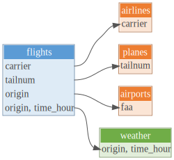

<!-- README.md is generated from README.Rmd. Please edit that file -->

# [dm](https://krlmlr.github.io/dm/)

<!-- badges: start -->

    

<!-- badges: end -->

## TL;DR

Are you using multiple data frames or database tables in R? Organize them with dm.

-   Use it today (if only like a list of tables).
-   Build data models tomorrow.
-   Deploy the data models to your organization’s RDBMS the day after.

## Overview

dm bridges the gap in the data pipeline between individual data frames and relational databases. It’s a [grammar of joined tables](https://twitter.com/drob/status/1224851726068527106) that provides a consistent set of verbs for consuming, creating, and deploying relational data models. For individual researchers, it broadens the scope of datasets they can work with and how they work with them. For organizations, it enables teams to quickly and efficiently create and share large, complex datasets.

dm objects encapsulate relational data models constructed from local data frames or lazy tables connected to an RDBMS. dm objects support the full suite of dplyr data manipulation verbs along with additional methods for constructing and verifying relational data models, including key selection, key creation, and rigorous constraint checking. Once a data model is complete, dm provides methods for deploying it to an RDBMS. This allows it to scale from datasets that fit in memory to databases with billions of rows.

## Features

dm makes it easy to bring an existing relational data model into your R session. As the dm object behaves like a named list of tables it requires little change to incorporate it within existing workflows. The dm interface and behavior is modeled after dplyr, so you may already be familiar with many of its verbs. dm also offers:

-   visualization to help you understand relationships between entities represented by the tables
-   simpler joins that “know” how tables are related, including a “flatten” operation that automatically follows keys and performs column name disambiguation
-   consistency and constraint checks to help you understand (and fix) the limitations of your data

That’s just the tip of the iceberg. See [Getting started](https://krlmlr.github.io/dm/articles/dm.html) to hit the ground running and explore all the features.

## Installation

The latest stable version of the {dm} package can be obtained from [CRAN](https://CRAN.R-project.org/package=dm) with the command

<pre class='chroma'>
<a href='https://rdrr.io/r/utils/install.packages.html'>install.packages</a>("dm")</pre>

The latest development version of {dm} can be installed from GitHub.

<pre class='chroma'>
# install.packages("devtools")
devtools::<a href='https://devtools.r-lib.org//reference/remote-reexports.html'>install_github</a>("krlmlr/dm")</pre>

## Usage

Create a dm object (see [Getting started](https://krlmlr.github.io/dm/articles/dm.html) for details).

<pre class='chroma'>
<a href='https://rdrr.io/r/base/library.html'>library</a>(<a href='https://krlmlr.github.io/dm/'>dm</a>)
dm &lt;- <a href='https://krlmlr.github.io/dm/reference/dm_nycflights13.html'>dm_nycflights13</a>()
dm
#&gt; ── Metadata ────────────────────────────────────────────────────────────────────
#&gt; Tables: `airlines`, `airports`, `flights`, `planes`, `weather`
#&gt; Columns: 53
#&gt; Primary keys: 3
#&gt; Foreign keys: 3</pre>

dm is a named list of tables:

<pre class='chroma'>
<a href='https://rdrr.io/r/base/names.html'>names</a>(dm)
#&gt; [1] "airlines" "airports" "flights"  "planes"   "weather"
<a href='https://rdrr.io/r/base/nrow.html'>nrow</a>(dm$airports)
#&gt; [1] 1458
dm$flights %&gt;%
  count(origin)
#&gt; # A tibble: 3 x 2
#&gt;   origin     n
#&gt; * &lt;chr&gt;  &lt;int&gt;
#&gt; 1 EWR     4043
#&gt; 2 JFK     3661
#&gt; 3 LGA     3523</pre>

Visualize relationships at any time:

<pre class='chroma'>
dm %&gt;%
  <a href='https://krlmlr.github.io/dm/reference/dm_draw.html'>dm_draw</a>()</pre>

Simple joins:

<pre class='chroma'>
dm %&gt;%
  <a href='https://krlmlr.github.io/dm/reference/dm_flatten_to_tbl.html'>dm_flatten_to_tbl</a>(flights)
#&gt; Renamed columns:
#&gt; * year -&gt; flights.year, planes.year
#&gt; * name -&gt; airlines.name, airports.name
#&gt; # A tibble: 11,227 x 35
#&gt;    flights.year month   day dep_time sched_dep_time dep_delay arr_time
#&gt;           &lt;int&gt; &lt;int&gt; &lt;int&gt;    &lt;int&gt;          &lt;int&gt;     &lt;dbl&gt;    &lt;int&gt;
#&gt;  1         2013     1    10        3           2359         4      426
#&gt;  2         2013     1    10       16           2359        17      447
#&gt;  3         2013     1    10      450            500       -10      634
#&gt;  4         2013     1    10      520            525        -5      813
#&gt;  5         2013     1    10      530            530         0      824
#&gt;  6         2013     1    10      531            540        -9      832
#&gt;  7         2013     1    10      535            540        -5     1015
#&gt;  8         2013     1    10      546            600       -14      645
#&gt;  9         2013     1    10      549            600       -11      652
#&gt; 10         2013     1    10      550            600       -10      649
#&gt; # … with 11,217 more rows, and 28 more variables: sched_arr_time &lt;int&gt;,
#&gt; #   arr_delay &lt;dbl&gt;, carrier &lt;chr&gt;, flight &lt;int&gt;, tailnum &lt;chr&gt;, origin &lt;chr&gt;,
#&gt; #   dest &lt;chr&gt;, air_time &lt;dbl&gt;, distance &lt;dbl&gt;, hour &lt;dbl&gt;, minute &lt;dbl&gt;,
#&gt; #   time_hour &lt;dttm&gt;, airlines.name &lt;chr&gt;, airports.name &lt;chr&gt;, lat &lt;dbl&gt;,
#&gt; #   lon &lt;dbl&gt;, alt &lt;dbl&gt;, tz &lt;dbl&gt;, dst &lt;chr&gt;, tzone &lt;chr&gt;, planes.year &lt;int&gt;,
#&gt; #   type &lt;chr&gt;, manufacturer &lt;chr&gt;, model &lt;chr&gt;, engines &lt;int&gt;, seats &lt;int&gt;,
#&gt; #   speed &lt;int&gt;, engine &lt;chr&gt;</pre>

Check consistency:

<pre class='chroma'>
dm %&gt;%
  <a href='https://krlmlr.github.io/dm/reference/dm_examine_constraints.html'>dm_examine_constraints</a>()
#&gt; ! Unsatisfied constraints:
#&gt; ● Table `flights`: foreign key tailnum into table `planes`: 1640 entries (14.6%) of `flights$tailnum` not in `planes$tailnum`: N722MQ (27), N725MQ (20), N520MQ (19), N723MQ (19), N508MQ (16), …</pre>

Learn more in the [Getting started](https://krlmlr.github.io/dm/articles/dm.html) article.

## Getting help

If you encounter a clear bug, please file an issue with a minimal reproducible example on [GitHub](https://github.com/krlmlr/dm/issues). For questions and other discussion, please use [community.rstudio.com](https://community.rstudio.com/).

------------------------------------------------------------------------

License: MIT © cynkra GmbH.

Funded by:

   

------------------------------------------------------------------------

Please note that the ‘dm’ project is released with a [Contributor Code of Conduct](https://krlmlr.github.io/dm/CODE_OF_CONDUCT.html). By contributing to this project, you agree to abide by its terms.
