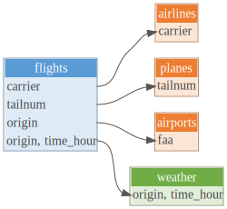

# [dm](https://dm.cynkra.com/)

> Are you using multiple data frames or database tables in R? Organize
> them with dm.
>
> - Use it for data analysis today.
> - Build data models tomorrow.
> - Deploy the data models to your organization’s Relational Database
>   Management System (RDBMS) the day after.

## Overview

dm bridges the gap in the data pipeline between individual data frames
and relational databases. It’s a grammar of joined tables that provides
a consistent set of verbs for consuming, creating, and deploying
relational data models. For individual researchers, it broadens the
scope of datasets they can work with and how they work with them. For
organizations, it enables teams to quickly and efficiently create and
share large, complex datasets.

dm objects encapsulate relational data models constructed from local
data frames or lazy tables connected to an RDBMS. dm objects support the
full suite of dplyr data manipulation verbs along with additional
methods for constructing and verifying relational data models, including
key selection, key creation, and rigorous constraint checking. Once a
data model is complete, dm provides methods for deploying it to an
RDBMS. This allows it to scale from datasets that fit in memory to
databases with billions of rows.

## Features

dm makes it easy to bring an existing relational data model into your R
session. As the dm object behaves like a named list of tables it
requires little change to incorporate it within existing workflows. The
dm interface and behavior is modeled after dplyr, so you may already be
familiar with many of its verbs. dm also offers:

- visualization to help you understand relationships between entities
  represented by the tables
- simpler joins that “know” how tables are related, including a
  “flatten” operation that automatically follows keys and performs
  column name disambiguation
- consistency and constraint checks to help you understand (and fix) the
  limitations of your data

That’s just the tip of the iceberg. See [Getting
started](https://dm.cynkra.com/articles/dm.html) to hit the ground
running and explore all the features.

## Installation

The latest stable version of the {dm} package can be obtained from
[CRAN](https://CRAN.R-project.org/package=dm) with the command

``` r
install.packages("dm")
```

The latest development version of {dm} can be installed from R-universe:

``` r
# Enable repository from cynkra
options(
  repos = c(
    cynkra = "https://cynkra.r-universe.dev",
    CRAN = "https://cloud.r-project.org"
  )
)
# Download and install dm in R
install.packages('dm')
```

or from GitHub:

``` r
# install.packages("devtools")
devtools::install_github("cynkra/dm")
```

## Usage

Create a dm object (see [Getting
started](https://dm.cynkra.com/articles/dm.html) for details).

``` r
library(dm)
dm <- dm_nycflights13(table_description = TRUE)
dm
#> -- Metadata --------------------------------------------------------------------
#> Tables: `airlines`, `airports`, `flights`, `planes`, `weather`
#> Columns: 53
#> Primary keys: 4
#> Foreign keys: 4
```

dm is a named list of tables:

``` r
names(dm)
#> [1] "airlines" "airports" "flights"  "planes"   "weather"
nrow(dm$airports)
#> [1] 86
dm$flights %>%
  count(origin)
#> # A tibble: 3 × 2
#>   origin     n
#>   <chr>  <int>
#> 1 EWR      641
#> 2 JFK      602
#> 3 LGA      518
```

Visualize relationships at any time:

``` r
dm %>%
  dm_draw()
```



Simple joins:

``` r
dm %>%
  dm_flatten_to_tbl(flights)
#> Renaming ambiguous columns: %>%
#>   dm_rename(flights, year.flights = year) %>%
#>   dm_rename(flights, month.flights = month) %>%
#>   dm_rename(flights, day.flights = day) %>%
#>   dm_rename(flights, hour.flights = hour) %>%
#>   dm_rename(airlines, name.airlines = name) %>%
#>   dm_rename(airports, name.airports = name) %>%
#>   dm_rename(planes, year.planes = year) %>%
#>   dm_rename(weather, year.weather = year) %>%
#>   dm_rename(weather, month.weather = month) %>%
#>   dm_rename(weather, day.weather = day) %>%
#>   dm_rename(weather, hour.weather = hour)
#> # A tibble: 1,761 × 48
#>    year.flights month.…¹ day.f…² dep_t…³ sched…⁴ dep_d…⁵ arr_t…⁶ sched…⁷ arr_d…⁸
#>           <int>    <int>   <int>   <int>   <int>   <dbl>   <int>   <int>   <dbl>
#>  1         2013        1      10       3    2359       4     426     437     -11
#>  2         2013        1      10      16    2359      17     447     444       3
#>  3         2013        1      10     450     500     -10     634     648     -14
#>  4         2013        1      10     520     525      -5     813     820      -7
#>  5         2013        1      10     530     530       0     824     829      -5
#>  6         2013        1      10     531     540      -9     832     850     -18
#>  7         2013        1      10     535     540      -5    1015    1017      -2
#>  8         2013        1      10     546     600     -14     645     709     -24
#>  9         2013        1      10     549     600     -11     652     724     -32
#> 10         2013        1      10     550     600     -10     649     703     -14
#> # ℹ 1,751 more rows
#> # ℹ abbreviated names: ¹​month.flights, ²​day.flights, ³​dep_time,
#> #   ⁴​sched_dep_time, ⁵​dep_delay, ⁶​arr_time, ⁷​sched_arr_time, ⁸​arr_delay
#> # ℹ 39 more variables: carrier <chr>, flight <int>, tailnum <chr>,
#> #   origin <chr>, dest <chr>, air_time <dbl>, distance <dbl>,
#> #   hour.flights <dbl>, minute <dbl>, time_hour <dttm>, name.airlines <chr>,
#> #   name.airports <chr>, lat <dbl>, lon <dbl>, alt <dbl>, tz <dbl>, dst <chr>,
#> #   tzone <chr>, year.planes <int>, type <chr>, manufacturer <chr>,
#> #   model <chr>, engines <int>, seats <int>, speed <int>, engine <chr>,
#> #   year.weather <int>, month.weather <int>, day.weather <int>,
#> #   hour.weather <int>, temp <dbl>, dewp <dbl>, humid <dbl>, wind_dir <dbl>,
#> #   wind_speed <dbl>, wind_gust <dbl>, precip <dbl>, pressure <dbl>, …
```

Check consistency:

``` r
dm %>%
  dm_examine_constraints()
#> ! Unsatisfied constraints:
#> • Table `flights`: foreign key `tailnum` into table `planes`: values of `flights$tailnum` not in `planes$tailnum`: N725MQ (6), N537MQ (5), N722MQ (5), N730MQ (5), N736MQ (5), …
```

Learn more in the [Getting
started](https://dm.cynkra.com/articles/dm.html) article.

## Getting help

If you encounter a clear bug, please file an issue with a minimal
reproducible example on [GitHub](https://github.com/cynkra/dm/issues).
For questions and other discussion, please use
[community.rstudio.com](https://community.rstudio.com/).
