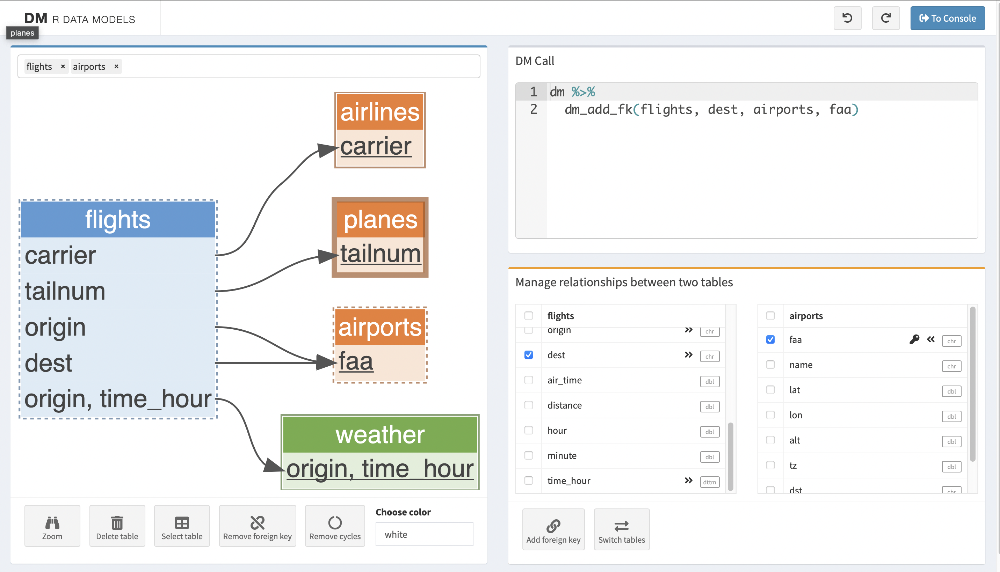

```{r, include = FALSE}
knitr::opts_chunk$set(
  collapse = TRUE,
  comment = "#>",
  echo = FALSE
)
```

[For printing](cheatsheet.html)

<div class="page1">
> If you have more than one table, use dm.

<div class="page1col1">
## <i class="fa-solid fa-circle-plus"></i> Create dm...

### <i class="fa-solid fa-database"></i> from database: `dm_from_con()`

```{r}
get_src <- function(src) {
  if (!nzchar(Sys.getenv("CHEATSHEET"))) {
    file.path("cheatsheet-figures", src)
  } else {
    sprintf("%s/%s", "cheatsheet-figures", src)
  }
}
get_svg <- function(path, alt) {
  svg <- xml2::read_xml(path)
  xml2::xml_remove(xml2::xml_find_all(svg, "//comment()"))
    xml2::xml_attr(svg, "class") <- "cheatsheet-svg"
    xml2::xml_attr(svg, "aria-labelledby") <- sprintf("svgDescription-%s", basename(path))
    xml2::xml_add_child(
      svg,
      .value = "description",
      alt,
      .where = 0
    )
    # to drop the XML declaration that messes things up
    temp_file <- withr::local_tempfile()
    xml2::write_xml(svg, file = temp_file, options = "format_whitespace")
    lines <- readLines(temp_file)
    lines <- lines[!grepl("^<\\?", lines)]
    lines <- lines[!grepl("^<!", lines)]
    glue::glue_collapse(lines, sep = "")
}
create_figure <- function(class, src, alt, caption) {
  if (!nzchar(Sys.getenv("CHEATSHEET"))) {
    path <- purrr::map_chr(src, get_src)
    svgs <- purrr::map2_chr(path, alt, get_svg)
    svgs <- paste0(rev(svgs), collapse = "")
    
    cat("<div class='cheatsheet-div'>")
    html <- sprintf('<div class="cheatsheet-caption">%s</div>', commonmark::markdown_html(caption))
    cat(html)
    cat(svgs)
    cat("</div>")
  } else {
    create_img <- function(alt, src) {
      sprintf('', alt, src)
    }
    src <- purrr::map_chr(src, get_src)
    imgs <- purrr::map2_chr(src, alt, create_img)
    imgs <- paste(imgs, collapse="")
    html <- sprintf(
      '
  <figure class="%s">
            %s
            <figcaption>
              %s
            </figcaption>
          </figure>
  ',
      class, imgs, commonmark::markdown_html(caption)
    )
    cat(html)
  }
}
```


```{r, results='asis'}
create_figure(
  class = "right",
  alt = "diagram showing the transformation from left a database icon to right a dm object represented as three tables in a blue frame",
  src = "dm_from_con.svg",
  caption = "```r\ncon <- DBI::dbConnect(...)
dm_from_con(con)\n```\n"
)
```

### <i class="fa-solid fa-table"></i> from data frames: `dm(df1, df2, ...)`

```{r, results='asis'}
create_figure(
  class = "right",
  alt = "diagram showing the transformation from left three data frames to right a dm object represented as three tables in a blue frame",
  src = "dm.svg",
  caption = "```r\ndm(df1, df2, df3)\n```\n"
)
```
         
### <i class="fa-solid fa-diagram-project"></i> from dm: `dm(dm1, df1...)`

```{r, results='asis'}
create_figure(
  class = "right",
  alt = "diagram showing the transformation from left a dm with a data frame below to right a single dm object represented as three tables in a blue frame",
  src = "dm-df.svg",
  caption = "```r\ndm(dm1, df1)\n```\n"
)
```

```{r, results='asis'}
create_figure(
  class = "right",
  alt = "diagram showing the transformation from left two dm objects to right a single dm object represented as three tables in a blue frame",
  src = "dm-dm.svg",
  caption = "```r\ndm(dm1, dm2)\n```\n"
)
```        

<hr class="d-none d-print-block"></hr>

### Add keys: `dm_add_pk()`, `dm_add_fk()`

**Automatic** for MariaDB, SQL Server, Postgres, and others.

#### <i class="fa-solid fa-key"></i> Primary keys

**Identify** potential primary keys:

- `dm_enum_pk_candidates()`: columns, candidate, why.

```{r, results='asis'}
create_figure(
  class = "right",
  alt = "left a single dm object represented as three tables in a blue frame, right the same but with markers for primary keys",
  src = "primary-keys.svg",
  caption = "**Add** primary keys:\n\n```r\ndm1 |>
  dm_add_pk(table, columns)\n```\n"
)
```        


**Identify** potential foreign keys:

- `dm_enum_fk_candidates()`: columns, candidate, why.

```{r, results='asis'}
create_figure(
  class = "right",
  alt = "left a single dm object represented as three tables in a blue frame, right the same but with an arrow to indicate a foreign key relationship",
  src = "fk.svg",
  caption = "**Add** foreign keys:\n\n```r\ndm1 |>
  dm_add_fk(table, column)\n```\n"
)
``` 
</div>
<div class="page1col2">
::: {.important-div}
### <i class="fa-solid fa-circle-info"></i> dm objects: relational data models

The dm package provides a **grammar of relational data models**. 
It helps maintain **referential integrity**.

A dm behaves like a list of tables (data frames or lazy tables) capturing
**relationships** between the tables.
:::

::: {.alert .alert-primary role="alert" style="display:grid;place-items:center;"}

<i class="fa-solid fa-arrow-up-right-from-square"></i> Shiny app: `dm_gui(dm = dm1)`

```{r, results='asis'}
cat(
  ''
)
```
            
:::

<hr class="d-none d-print-block"></hr>

## <i class="fa-solid fa-filter"></i> Resize dm

### Select tables: `dm_select_tbl(dm1, ...)`

```{r, results='asis'}
create_figure(
  class = "right",
  alt = "diagram showing two dm objects, the one on the right has one table less",
  src = "select_tbl.svg",
  caption = '```r\ndm1 |>
  dm_select_tbl(-df3)\n```\n'
)
``` 

### Rename tables: `dm_rename_tbl(dm1, ...)`

### Select columns: `dm_select(dm1, table, ...)`

Automatic update of dm meta-information and table relations.


```{r, results='asis'}
create_figure(
  class = "right",
  alt = "diagram showing two dm objects, the third table of the one on the right has two colmns less",
  src = "dm_select.svg",
  caption = '```r\ndm1 |>
  dm_select(df3, -c3, -c4)\n```\n'
)
```

### Rename columns: `dm_rename(dm1, table, ...)`

### Filter rows: `dm_filter(dm1, table = (pred))`

Filter rows in the table where the condition is defined, 
but also all directly/indirectly connected tables.

```{r, results='asis'}
create_figure(
  class = "right",
  alt = "diagram showing two dm objects, the one on the right has tables with less rows",
  src = "filter.svg",
  caption = '```r\ndm1 |>
  dm_filter(df3 = (x == "val"))\n```\n'
)
```
</div>
<div class="page1col3">

## <i class="fa-solid fa-eye"></i> Visualize dm: `dm_draw()`

### Control diagram level of detail: display...

- Only keys (default): `dm_draw(view_type = "keys_only")`.
- All variables: `dm_draw(view_type = "all")`.
- Only table names: `dm_draw(view_type = "title_only")`.

```{r, results='asis'}
create_figure(
  class = "right",
  alt = "Diagram with linked rectangles (tables). Only table names.",
  src = "draw-title_only.svg",
  caption = '```r\ndm |>
  dm_draw(
    view_type = "title_only",
    rankdir = "TB"
  )\n```\n'
)
``` 

### Control diagram scope

To visualize fewer tables first use `dm_select_tbl()`.

### Control diagram colors: `dm_set_colors()`

```{r, results='asis'}
create_figure(
  class = "right",
  alt = "Diagram with linked rectangles (tables). The flight table is pink, the airlines and airpots tables whose name start with 'air', are orange.",
  src = "df-pk-fk-col.svg",
  caption = '```r\ndm |>
  dm_set_colors(
    pink = flights,
    orange = starts_with("air")
  ) |>
  dm_draw()\n```\n'
)
``` 

<hr class="d-none d-print-block"></hr>
          
## <i class="fa-solid fa-check"></i> Data checks

### `dm_examine_constraints()`

tibble with information about which key constraints are met or violated.

### `dm_examine_cardinalities()`

tibble with information about the cardinality of the foreign keys constraints.

### `check_key(df, col1)`

returns an error if not an unique key.

### `check_subset(df1, df2)`

returns an error if `df1` is not a subset of `df2`.

### `check_set_equality(df1, df2)`

returns an error if `df1` and `df2` are not the same sets.

<hr class="d-none d-print-block"></hr>

### <i class="fa-solid fa-tags"></i> Fix column names: `dm_disambiguate_cols()`

`dm_disambiguate_cols(dm1)` ensures that all columns in a dm have unique names.
</div>
</div>
<div class="page2">
<div class="page2col1">

## <i class="fa-solid fa-table"></i> Transform dm into tibble

### Wide tibble: Cascade joins with `dm_flatten_to_tbl()`

Only direct neighbours: `dm_flatten_to_tbl()`

```{r, results='asis'}
create_figure(
  class = "big",
  alt = "On the left a dm object where table A is linked to table B and table C. Table D is linked to table B. On the right a table corresponding to a join of table A, B and C. Not D as it is not a direct neighboor",
  src = "flatten.svg",
  caption = '```r\ndm1 |>
  dm_flatten_to_tbl(
.start = df1
)\n```\n'
)
```

All neighbours: `dm_flatten_to_tbl(.recursive = TRUE)`

```{r, results='asis'}
create_figure(
  class = "big",
  alt = "On the left a dm object where table A is linked to table B and table C. Table D is linked to table B. On the right a table corresponding to a join of table A, B, C and D as they can all be reached from table A albeit indirectly.",
  src = "squash.svg",
  caption = '```r\ndm1 |>
  dm_flatten_to_tbl(
.start = df1,
.recursive = TRUE
)\n```\n'
)
```


### Single tibble dm: `dm_wrap_tbl()`

Parent tables are packed &#8212; `dm_pack_tbl()`.

Child tables are nested &#8212; `dm_nest_tbl()`.

```{r, results='asis'}
create_figure(
  class = "big",
  alt = "On the left a dm object (tables with arrows in a frame) where a green table is linked to a parent blue table and a child purple table. On the right another dm object with a single table in a frame. The blue parent table became a packed column in the green table (a column that contains a data frame) and the purple child table became a nested table (a table in each cell).",
  src = "dm_wrap_tbl.svg",
  caption = '```r\ndm1 |>
  dm_wrap_tbl(
root = green_df
)\n```\n'
)
```

### Retrieve one table of the dm: `pull_tbl()`

```{r, results='asis'}
create_figure(
  class = "big",
  alt = "On the left a dm object with three tables, on the right only a table. The primary key information has been kept which is represented by the first column of that table having kept its dark background.",
  src = "pull-keyed.svg",
  caption = '```r\ndm1 |>
  pull_tbl(
dm1,
green_df,
keyed = TRUE
)\n```\n'
)
```

```{r, results='asis'}
create_figure(
  class = "big",
  alt = "On the left a dm object with three tables. There is a magnifying glass on the green table. On the right only the green table.",
  src = "pull2.svg",
  caption = 'If the dm is zoomed, retrieve zoomed table automatically.\n\n```r\ndm1 |>
  dm_zoom_to(green_df) |>
pull_tbl()\n```\n'
)
```
</div>
<div class="page2col2">
## <i class="fa-solid fa-screwdriver-wrench"></i> Mutate, create, analyze tables

### <i class="fa-solid fa-hammer"></i> Method 1: deconstruct and reconstruct

1. `dm_get_tables(keyed = TRUE)`: <br />
    to keep information on primary and foreign keys).

```{r, results='asis'}
create_figure(
  class = "",
  alt = "diagram showing the transformation from left a dm object to right a named list of the same table, instead of a solid border frame on the right the frame has a dotted border",
  src = "deconstruct.svg",
  caption = '```r\ndm_tbl <- dm1 |>
  dm_get_tables(keyed = TRUE)\n```\n'
)
```

2. tidyverse pipeline on the table of interest.

```{r, results='asis'}
create_figure(
  class = "right",
  alt = "on the left a table, on the right the same table with one more column",
  src = "mutate.svg",
  caption = '```r\nnew_table1 <- dm_tbl$table1 |>
  mutate(...)\n```\n'
)
```

3. Optional: update the dm object:

```{r, results='asis'}
create_figure(
  class = "right",
  alt = "on the left a dm of three tables, on the right the same dm but one of the tables has one column more",
  src = "reconstruct.svg",
  caption = '```r\ndm1 |>
  dm_select_tbl(-table1) |>
  dm(table1 = new_table1)\n```\n'
)
```

### <i class="fa-solid fa-magnifying-glass"></i> Method 2: zoom

1. `dm_zoom_to()`: Zoom on a table.

```{r, results='asis'}
create_figure(
  class = "right",
  alt = "On the left a dm object with three tables. On the right the same object but there is now a magnifying glass on the green table.",
  src = "zoom1.svg",
  caption = '```r\nzoomed_dm1 <- dm1 |>
  dm_zoom_to(green_df)\n```\n'
)
```

2. tidyverse pipeline (`mutate()`, etc.).

```{r, results='asis'}
create_figure(
  class = "right",
  alt = "On the left a dm object with three tables including a green table with a magnifying glass on it. On the right the same object but there is now a second green table superimposed, with one more column compared to the green table in the dm.",
  src = "zoom2.svg",
  caption = '```r\nzoomed_dm2 <- zoomed_dm1 |>
  mutate(var = thing)\n```\n'
)
```

3. `dm_update_zoomed()` (replace) /
    `dm_insert_zoomed()`

```{r, results='asis'}
create_figure(
  class = "right",
  alt = "On the left a dm object featuring a second green table superimposed, with one more column compared to the green table in the dm. On the right the magnifying glass and second green table disappeared. Instead the green table in the dm has the new column.",
  src = "zoom3.svg",
  caption = '```r\ndm3 <- zoomed_dm2 |>
  dm_update_zoomed()\n```\n'
)
```
    
</div>
<div class="page2col3">
## <i class="fa-solid fa-database"></i> Modify database source of a dm

### <i class="fa-solid fa-download"></i> Export dm object to database:  `copy_dm_to()`

Need a **database connection &#8212; `DBI::dbConnect()`**.

```{r, results='asis'}
create_figure(
  class = "right",
  alt = "On the left a dm object, with an arrow pointing to on the right a database icon",
  src = "copy_dm.svg",
  caption = '```r\ncon <- DBI::dbConnect(...)
  # Persistent tables:
persistent_dm &lt;- copy_dm_to(
con,
dm1,
temporary = FALSE
)

DBI::dbDisconnect(con)\n```\n'
)
```

## <i class="fa-solid fa-plus-minus"></i> Insert, update or remove rows in a dm

Methods:

- `dm_rows_insert(dm1, dm2)`: adds new rows
- `dm_rows_update(dm1, dm2)`: changes values in rows
- `dm_rows_patch(dm1, dm2)`: fills in missing values
- `dm_rows_upsert(dm1, dm2)`: adds new or changes rows
- `dm_rows_delete(dm1, dm2)`: deletes rows

```
dm1 |>
dm_rows_insert(dm2, in_place = FALSE)
```

```{r, results='asis'}
create_figure(
  class = "left",
  alt = c(
    "Equal sign then a dm object where the blue table has now more rows.", 
    "On the left a dm object with 3 tables. On the right, a similar dm where one of the tables, the blue one, has more rows. Between the two is a plus sign"
    ),
  src = c("insert2.svg", "insert1.svg"),
  caption = NULL
)
```

```r
dm1 |>
dm_rows_insert(dm2, in_place = TRUE)
```

```{r, results='asis'}
create_figure(
  class = "left",
  alt = c(
    "Database icon.", 
    "On the left a dm object with 3 tables, and a database icon superimposed. On the right, a similar dm where one of the tables, the blue one, has more rows. Between the two is a plus sign"
    ),
  src = c("insert4.svg", "insert3.svg"),
  caption = NULL
)
```

A dm is immutable, except with

- <i class="fa-solid fa-check"></i> these functions AND
- <i class="fa-solid fa-check"></i> a mutable backend (database) AND
- <i class="fa-solid fa-check"></i> `in_place = TRUE`.
</div>
</div>

```{r, echo=FALSE, message=FALSE, warning=FALSE, results='hide'}
source(system.file("make-cheatsheet.R", package = "dm"))
```
